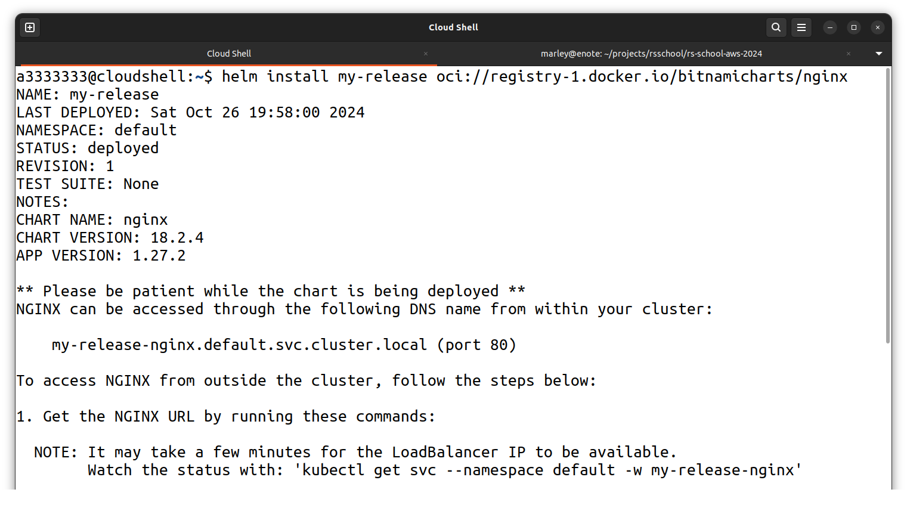
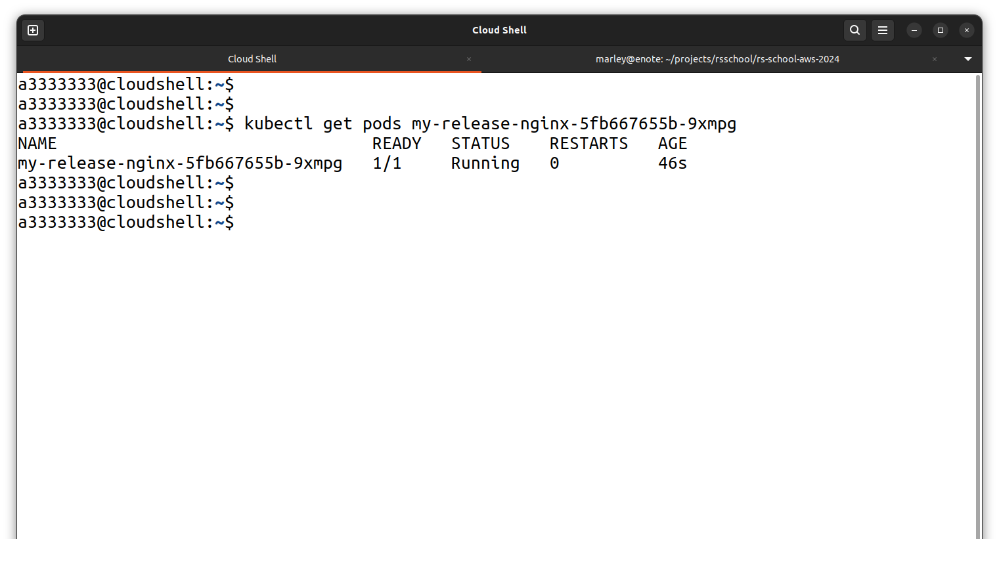
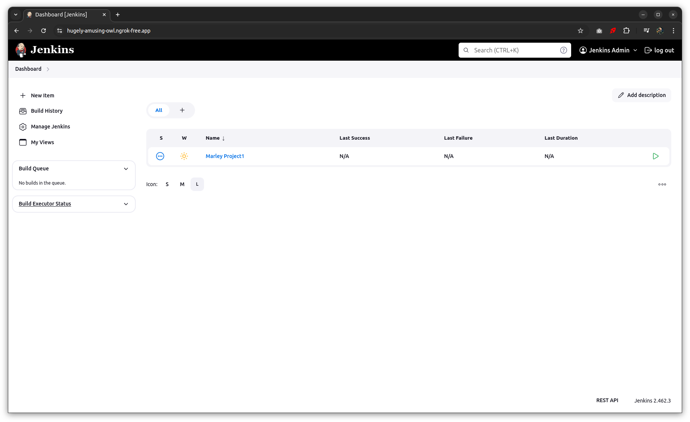
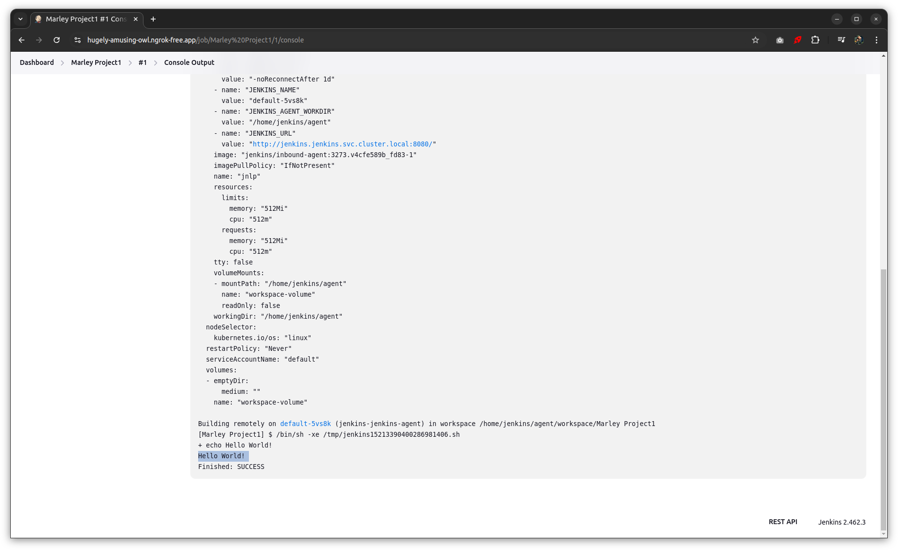

# [Task 4: Jenkins Installation and Configuration](https://github.com/rolling-scopes-school/tasks/blob/master/devops/modules/3_ci-configuration/task_4.md)

<br/>

Date:  
2024.10.26

<br/>

### Helm Installation and Verification (10 points)

```
$ helm install my-release oci://registry-1.docker.io/bitnamicharts/nginx
$ helm uninstall my-release
```

<br/>




<br/>




<br/>

Docs:  
https://www.jenkins.io/doc/book/installing/kubernetes/#install-jenkins-with-helm-v3

<br/>

```
$ helm repo add jenkinsci https://charts.jenkins.io
$ helm repo update
```

<br/>

```
$ helm search repo jenkinsci
NAME             	CHART VERSION	APP VERSION	DESCRIPTION
jenkinsci/jenkins	5.7.8        	2.462.3    	Jenkins - Build great things at any scale! As t...
```

<br/>

```
$ kubectl create namespace jenkins
```

<br/>

### Create a persistent volume

<br/>

```yaml
$ cat << 'EOF' | kubectl apply -f -
---
apiVersion: v1
kind: PersistentVolume
metadata:
  name: jenkins-pv
  namespace: jenkins
spec:
  storageClassName: jenkins-pv
  accessModes:
    - ReadWriteOnce
  capacity:
    storage: 20Gi
  persistentVolumeReclaimPolicy: Retain
  hostPath:
    path: /data/jenkins-volume/
---
apiVersion: storage.k8s.io/v1
kind: StorageClass
metadata:
  name: jenkins-pv
provisioner: kubernetes.io/no-provisioner
volumeBindingMode: WaitForFirstConsumer
EOF
```

<br/>

```
$ export \
    PROFILE=${USER}-minikube
```

<br/>

```
$ minikube ssh --profile ${PROFILE}
minikube:~$ sudo mkdir -p /data/jenkins-volume
minikube:~$ sudo chown -R 1000:1000 /data/jenkins-volume

^D
```

<br/>

### Create a service account

<br/>

```yaml
$ cat << 'EOF' | kubectl apply -f -
---
apiVersion: v1
kind: ServiceAccount
metadata:
  name: jenkins
  namespace: jenkins
---
apiVersion: rbac.authorization.k8s.io/v1
kind: ClusterRole
metadata:
  annotations:
    rbac.authorization.kubernetes.io/autoupdate: "true"
  labels:
    kubernetes.io/bootstrapping: rbac-defaults
  name: jenkins
rules:
- apiGroups:
  - '*'
  resources:
  - statefulsets
  - services
  - replicationcontrollers
  - replicasets
  - podtemplates
  - podsecuritypolicies
  - pods
  - pods/log
  - pods/exec
  - podpreset
  - poddisruptionbudget
  - persistentvolumes
  - persistentvolumeclaims
  - jobs
  - endpoints
  - deployments
  - deployments/scale
  - daemonsets
  - cronjobs
  - configmaps
  - namespaces
  - events
  - secrets
  verbs:
  - create
  - get
  - watch
  - delete
  - list
  - patch
  - update
- apiGroups:
  - ""
  resources:
  - nodes
  verbs:
  - get
  - list
  - watch
  - update
---
apiVersion: rbac.authorization.k8s.io/v1
kind: ClusterRoleBinding
metadata:
  annotations:
    rbac.authorization.kubernetes.io/autoupdate: "true"
  labels:
    kubernetes.io/bootstrapping: rbac-defaults
  name: jenkins
roleRef:
  apiGroup: rbac.authorization.k8s.io
  kind: ClusterRole
  name: jenkins
subjects:
- apiGroup: rbac.authorization.k8s.io
  kind: Group
  name: system:serviceaccounts:jenkins
EOF
```

<br/>

### Install Jenkins

```
$ mkdir -p ~/tmp
$ cd ~/tmp
$ wget https://raw.githubusercontent.com/jenkinsci/helm-charts/main/charts/jenkins/values.yaml -O jenkins-values.yaml
$ vi jenkins-values.yaml
```

<br/>

```
  storageClass: jenkins-pv
```

<br/>

```
serviceAccount:
  create: false
  name: jenkins
```

<br/>

```
$ helm install jenkins -n jenkins -f jenkins-values.yaml jenkinsci/jenkins

// uninstall
// $ helm uninstall jenkins -n jenkins
```

<br/>

```
$ kubectl get pods -n jenkins
NAME        READY   STATUS    RESTARTS   AGE
jenkins-0   2/2     Running   0          7m45s
```

<br/>

```
// Get your 'admin' user password by running:

$ jsonpath="{.data.jenkins-admin-password}"
4 secret=$(kubectl get secret -n jenkins jenkins -o jsonpath=$jsonpath)
$ echo $(echo $secret | base64 --decode)
```

<br/>

### [ngrok instruction to run](//gitops.ru/tools/containers/kubernetes/minikube/ngrok-ingress-controller/)

<br/>

```
$ export NGROK_DOMAIN="hugely-amusing-owl.ngrok-free.app"
```

<br/>

```yaml
$ envsubst << 'EOF' | cat | kubectl create -f -
apiVersion: networking.k8s.io/v1
kind: Ingress
metadata:
  name: ngrok-jenkins-ingress-service
  namespace: jenkins
spec:
  ingressClassName: ngrok
  rules:
    - host: ${NGROK_DOMAIN}
      http:
        paths:
          - path: /
            pathType: Prefix
            backend:
              service:
                name: jenkins
                port:
                  number: 8080
EOF
```

<br/>

WORKS!

<br/>



<br/>




<br/><br/>

---

<br/>

**Marley**

Any questions in english: <a href="https://gitops.ru/chat/">Telegram Chat</a>  
Любые вопросы на русском: <a href="https://gitops.ru/chat/">Телеграм чат</a>
